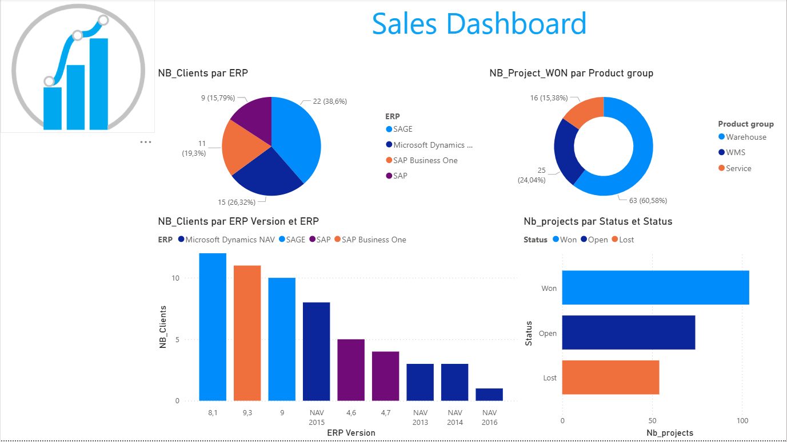
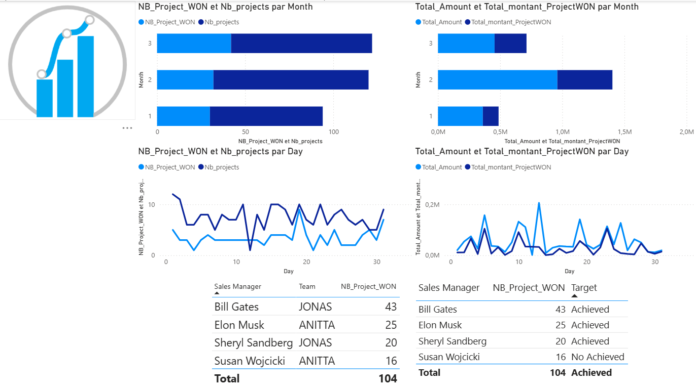

# Power BI Sales & Business Performance Dashboard

## 📊 Project Overview

This project presents an interactive Power BI dashboard developed for an American enterprise operating across logistics, production, and service-related activities.

The dashboard transforms business data into clear and actionable insights, helping management monitor sales performance, revenue, projects, customers, products, ERP systems, and sales targets.

## 🎯 Objectives

- Monitor sales and revenue performance
- Analyze sales trends over time
- Track projects and customer activity
- Compare product groups and ERP systems
- Evaluate sales managers' performance
- Monitor targets and achievement rates
- Support data-driven decision-making

## 📈 Dashboard Features

- Sales & revenue KPIs
- Monthly and daily performance analysis
- Customer and project analysis
- Product group analysis
- ERP system analysis
- Sales manager performance
- Target vs. actual performance
- Interactive filters and visualizations

## 🛠️ Tools & Technologies

- Microsoft Power BI
- Power Query
- DAX
- Data Modeling
- Data Visualization

## 🖥️ Dashboard Preview

### Sales Performance Dashboard

### Business Performance Dashboard

## 💡 Business Value

This dashboard demonstrates how Business Intelligence and data visualization can transform raw business data into actionable insights, helping organizations monitor performance, identify trends, and make data-driven decisions.

Data Analytics | Power BI | Business Intelligence
